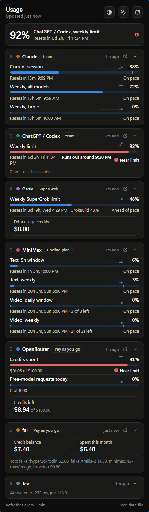
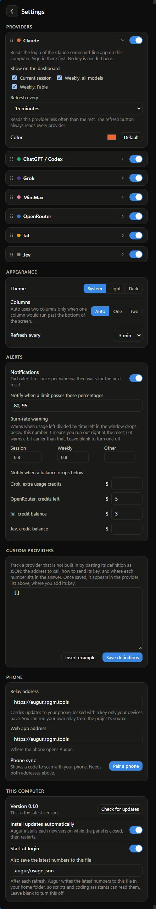
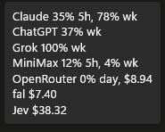

# Augur

Augur shows how much of your AI plans and credits you have used, in one place: a tray icon on Windows, a menu-bar icon on macOS, a full-screen app for the terminal, and a web app you can add to a phone's home screen. It reads the same numbers each provider's own usage page shows, refreshes each one on its own schedule, and warns you when a limit is running out faster than its window resets.

<table align="center">
  <tr>
    <td align="center" valign="top" width="50%">
      <br>
      <sub>The panel shows your most-used limit at the top and a card for each provider below it.</sub>
    </td>
    <td align="center" valign="top" width="50%">
      <br>
      <sub>In settings you choose what each card shows, how often it refreshes, and when Augur warns you.</sub>
    </td>
  </tr>
</table>

## What it tracks

| Provider | What you see | What it needs |
| --- | --- | --- |
| Claude | Current session, weekly limit, weekly limit per model, limit resets | The Claude Code app signed in on this computer, plus a one-time sign-in to claude.ai for the resets |
| Codex | Weekly plan limit, limit resets available | The Codex CLI signed in on this computer |
| Grok | Weekly SuperGrok limit | The Grok CLI signed in on this computer |
| MiniMax | Coding plan: 5-hour and weekly text limits, video counts | An API key |
| OpenRouter | Credits left, spend by the key today, this week and this month | An API key |
| fal | Credit balance, spend this month, top endpoints | An admin API key |
| Jev (TypeSafe) | Credit balance, spend and requests over the last 7 days, response time | An API key, plus a one-time sign-in to the TypeSafe console for the balance |

Claude, Codex and Grok only report plan limits to their own signed-in apps, so the desktop app reads those three. An API key for Anthropic, OpenAI or xAI shows API billing, not plan limits, so it cannot stand in for the sign-in. The phone app shows them once you pair it with your desktop (see below).

You can add any other provider whose usage endpoint returns JSON, without writing code. See [Custom providers](#custom-providers).

## Install

Every installer is on the [releases page](https://github.com/neostryder/augur/releases/latest). Augur is built and used mostly on Windows. The macOS and Linux apps come from the same code and the same release but get less testing. Running jobs for agents works on all three.

**Windows:** download the installer and run it. No administrator rights are needed. The installer is not code-signed yet, so Windows SmartScreen may warn the first time; choose More info, then Run anyway. The icon may land in the hidden-icons area at first. Drag it onto the taskbar to keep it in view.

**macOS:** download the `.dmg` (one build runs on both Apple silicon and Intel) and drag Augur into Applications. The app is not signed with an Apple developer certificate yet, so macOS blocks it the first time you open it. Open System Settings, go to Privacy & Security, choose Open Anyway next to the message about Augur, and confirm. After that it opens normally.

**Linux:** download the AppImage (runs on most distributions, including Arch, as long as WebKitGTK 4.1 is installed), or the `.deb` or `.rpm`. The tray icon needs an AppIndicator host: KDE Plasma has one built in, and GNOME needs the AppIndicator extension. On Linux the panel opens from the icon's menu rather than a click.

**Terminal only:** a computer with no tray or taskbar can run the terminal app and the background service without the window app (see [In a terminal](#in-a-terminal)). On Arch Linux, build the `augur-terminal` package from a checkout of this repository with `makepkg -si` in `packaging/arch/augur-terminal`; it needs only Node.js 24 or newer. `packaging/arch/augur-bin` builds the window app from the release's `.deb` instead. The window app takes the `augur` name on Linux, so that package puts the command on your PATH as `augur-cli`. Install one of the two, not both. On macOS, run the install script. It downloads the newest terminal build, checks it against the release's `SHA256SUMS.txt`, and puts `augur` in `~/.local/bin`:

```bash
curl -fsSL https://github.com/neostryder/augur/releases/latest/download/install.sh | sh
```

The macOS build carries its own copy of Node, so nothing else has to be installed. Run `augur update` to move to a newer version; the previous one stays in place until the update after that.

Every release also carries `SHA256SUMS.txt`, with a checksum for each installer, and a bill of materials for the JavaScript and Rust dependencies. Since the installers are not signed, compare a download against its line in that file before you run it: `Get-FileHash <file>` on Windows, `shasum -a 256 <file>` on macOS, `sha256sum <file>` on Linux.

The first launch shows a setup screen. Providers that are already signed in on the computer are turned on for you. For the others, paste an API key and turn them on. The Claude, Codex and Grok cards need the matching app signed in on this computer. Without one of them, turn on a provider that takes an API key, such as OpenRouter. Keys are stored in the operating system's keychain (Windows Credential Manager, the macOS Keychain, or the Secret Service on Linux), and each one is sent only to its own provider.

To see your TypeSafe balance, open Jev in settings and choose Sign in. Augur keeps that console session in its own window and uses it only to read your billing page.

To count your Claude limit resets, open Claude in settings, turn on Read resets from claude.ai and choose Sign in. Augur keeps that session in its own window and uses it only to read your usage page, about every six hours. Without the sign-in, enter the count under Limit resets in hand.

## Using it

Click the icon to open the panel. The ring on the icon shows your most-used limit, and its color turns amber at 75% and red at 90%. Hover over it for one line per provider without opening the panel. Ctrl+Super+U opens and closes the panel from any app (Super is the Windows key, or Command on a Mac), and settings can change or turn off that shortcut. The panel also opens by itself each time Augur starts; turn off Open the panel at launch in settings to keep it in the tray until you open it.

<p align="center">
  <br>
  <sub>Hovering over the tray icon shows every provider at a glance.</sub>
</p>

Each meter shows how much is used, when it resets, and a thin mark on the bar for where even pace would put you. Click a meter to see the last seven days, with dashed lines at each reset. Drag a card by its handle to change the order, and collapse cards you only check now and then. The panel switches to two columns when one column would not fit on the screen, or you can pick one or two columns in settings.

Augur checks for a new version every 5 minutes. When one is ready, an Update button appears next to refresh: hover over it to see what changed, or click it to install and restart. Augur also installs it on its own while the panel is closed, unless you turn that off in settings.

Settings also cover the theme (system, light or dark), which meters each card shows, card colors, how often each provider refreshes (from every 15 seconds to once a week), and alerts. Providers refresh every 15 minutes by default and Jev once a week, a provider whose last read failed tries again after 5 minutes, and the refresh button reads every provider at once.

## Alerts

Augur can notify you when:

- a limit passes a percentage you choose, such as 80% and 95%.
- a limit is burning too fast, meaning the usage left divided by the time left in its window drops below a ratio you set. Session and weekly limits each get their own ratio. At 1.0 you run out right at the reset, and 0.8 warns earlier.
- a credit balance drops below an amount you set.
- a plan is spent and a limit reset is in hand, for providers that report resets such as Codex, so you can use the reset to keep working.

A percentage, reset or balance alert fires once per window and waits for the next reset before it can fire again. A burn-rate alert repeats at most once a day while the limit keeps burning too fast.

An alert stays under the bell at the top of the panel until you dismiss it or it stops applying, for example when the window resets. The grid under Alerts in settings picks where each kind of alert goes: your computer's notifications, the bell, Claude Code, and a paired phone. Updates and failed refreshes go to the bell only, unless you change that. A paired phone shows the same alerts under its own bell, and with Push notifications turned on in the phone app it gets them even while Augur is closed there. Dismissing an alert in one place clears it in the others.

## Claude

Augur can show up inside Claude too. Settings has a Claude section with two switches.

Turn on Claude Code and your next Claude Code session shows Claude's 5-hour and weekly use in the status line, along with any other provider past 70%. A new alert pops up once, then sits in a row above the prompt until you press D to dismiss it, which clears it in Augur and on your phone as well. Press O there to bring up Augur. This switch needs the usage file, so it turns that on at `.augur/usage.json` if you had it off. Augur updates the mod when it updates itself, and turning the switch off takes the mod back out.

Claude Desktop chat lets your chats in Claude Desktop pick and run models through Augur. It is available on Windows and macOS, and on Linux where Claude Desktop's settings folder exists. Restart Claude Desktop after you flip it. Turning it off removes only what Augur added to Claude Desktop's settings.

## In a terminal

Run `augur` in a terminal and it opens a full-screen version of the panel. Tabs across the top hold Usage, Alerts, Rules, Dispatch and Settings. Press 1 to 5 or Tab to move between them and ? for the keys on the page you are on. The terminal app starts the Augur service if it is not running, and the window app and the terminal app are two views of that one service, so a change in either shows in the other. Providers, alerts, rules, routes, jobs, phone pairing and the Claude Code and Claude Desktop switches are all there. The sign-ins that need a browser window, such as the Claude resets and the TypeSafe balance, still need the window app. Pairing draws its QR code in the terminal when the terminal is tall enough, and shows the link with a key to copy it when it is not.

The same command answers short questions that suit a status bar or a script:

```bash
augur status               # Claude's session and week, anything running hot, and the alert count
augur status --waybar      # the same as the JSON a Waybar custom module reads
augur refresh              # read every provider now
augur alerts               # list the alerts; add dismiss <id>, or --all, to clear them
augur claude install code  # or desktop; status and remove work too
```

`augur status --waybar` prints `text`, `tooltip` and `class`. The class is `ok`, `warn` or `crit`, and `off` when the service is not running; the command never starts the service. `augur service enable` starts the service at each login, through a systemd user unit on Linux or a launch agent on macOS, and `augur service disable` turns that off. Alerts sent to your computer's notifications use `notify-send` on Linux, so install `libnotify` if the command is missing, and the system notification center on macOS.

## Model rules

The rules page (the icon at the top of the panel) lists every model Augur has seen on your plans and lets you decide what agents may use each one for. Each model has a status, the activities it may do (write code, research, summarize and so on), the most sensitive data it may see (public, internal, sensitive or regulated), whether an agent has to be told to use it by name, whether it may write files or only text and patches, a cost step from free to very high, and how its provider handles prompts. A model can also be paused until a time you pick, either skipped or scored with replacement weights, and Dial back pauses every high-cost model until the next reset. A new provider starts with cautious defaults that its models inherit (public data only, text output, named before use), and every model starts unreviewed, so nothing can be used until you confirm it and allow its activities. Rules save to `policy.json` in `~/.augur`, and an agent or script reads that file. Each change goes into a history you can undo from, and a paired phone and desktop merge their edits, keeping the newer one for each field.

A model can also wait on others. Check models under Use only after and the model stays out of picks until every one of them is spent, paused, not allowed for the task, or down. The providers of the models it waits on are then used up in full instead of paced, so a Codex plan runs to its limit before Copilot's GPT-6 Sol is picked. A spent provider still counts while it has a limit reset in hand, so the models waiting on it stay held until the reset is used. A limit reset in hand, which Codex reports and Claude needs entered in its provider settings, counts as one more full weekly window of room for a provider that is paced, and a pick says when a spent provider still has a reset waiting.

## Running jobs for agents

Turn on Also run jobs in setup or on the Service page and Augur starts a service on your computer. An agent asks it which model to use with `augur pick`, then runs the task with `augur run`. The service checks your rules and how much of each plan is left before it starts anything, and a job that breaks a rule is refused with the reason. On Windows the `augur` command is `service\augur.cmd` inside the install folder (`%LOCALAPPDATA%\Augur`), which is not on your PATH. In the macOS app it is `Contents/Resources/service/augur` inside Augur.app, and a terminal install already has it on your PATH. In the Linux `.deb` it is `/usr/lib/Augur/service/augur`, and the Arch packages put it on your PATH as `augur` (`augur-terminal`) or `augur-cli` (`augur-bin`).

```bash
augur pick --activity write_code --data internal
augur run luna --activity write_code --data internal --prompt "Add tests for parse()" --wait
augur usage
```

Here `luna` is a route you added on the Routes page. To add one, choose Add route, name it, pick the model it runs and the adapter that runs it (Codex CLI, Grok CLI, GitHub Copilot CLI, or an OpenAI-style or Anthropic-style API, among others), and fill in the options the form marks as required. Test route sends one word through it, so a bad path or a missing key shows up before an agent depends on the route.

A run has to state its activity and data tier, and it has to follow a pick made for the same caller in the last hour. `--activity` takes one of `write_code`, `review_code`, `research`, `reason_critique`, `draft_prose`, `summarize_extract`, `long_context`, `bulk_tagging`, `typed_decisions`, `read_images`, `generate_images`, `generate_video` or `speech`. `--data` takes `public`, `internal`, `sensitive` or `regulated`, and a model is only offered for data at or below the tier its rules allow. A caller is whatever asks: the `augur` command, an MCP client or a script. `augur --help` lists every command.

- The Jobs page lists what agents started, with each job's result, output and errors, and lets you cancel one that is still going. Cancelling a job, or a job reaching its time limit, ends everything it started: through a job object on Windows, a systemd user scope on Linux where systemd runs, and the job's process group otherwise.
- The Routes page joins a model to the program that runs it. A route is an entry in `dispatch/routes.json`, and Test route checks that it works. An API route can keep its key in the operating system's key store: choose store as the key source and save the key on the page, and it never appears in `routes.json` or a job record. The store is the Windows credential store, the macOS Keychain, or the Secret Service on Linux, with a file only you can read as the fallback where no Secret Service answers.
- The Service page holds the service's settings, and `augur config` shows the same list.
- Tokens and cost appear with each job, labelled reported, derived or imputed. [docs/accounting.md](docs/accounting.md) explains how they are worked out and how to set a rate.
- `augur-mcp`, beside `augur` (`augur-mcp.cmd` on Windows), lets Claude Code, Claude Desktop and other MCP clients pick and run models under the same rules. See [docs/mcp.md](docs/mcp.md).

Uninstalling Augur stops the service and removes the program, and leaves your job history and your rules behind. The history is in `%LOCALAPPDATA%\Augur\dispatch` on Windows and `~/.local/share/augur/dispatch` on macOS and Linux, and the rules are in `~/.augur`. Delete those folders to remove everything.

### Who classifies tasks

`augur pick --task "..."` can work out the activity and data tier from a description. The setup screen and the Service page ask who does that.

### How a pick balances models

A pick also leans toward a model that fits the task. Coding and hard reasoning are deep work and go to the strong models (Opus, Sol, Grok) first. Reviews, research, summaries and bulk work are everyday work and go to the lighter ones (Sonnet, Luna, DeepSeek, MiniMax), which keeps the strong models' usage for the tasks that need them. Prose goes to Opus at any depth. Each route also gets a lift on the activities it is known for, such as MiniMax on long context and ChatGPT on research. Fable and Astra are never picked unless a caller names one. `--depth deep` or `--depth everyday` overrides the default for one task, and the pick prints a line saying why the top model won and which came next.

Claude's usage has its own pace check. The week and the 5-hour window are each compared with how much of them has passed, and the stricter one wins: more than 5 points ahead leans toward Sonnet, more than 5 behind leans toward Opus, and a window at 90% sends optional work to other routes while any can take it. A caller that names a model still gets it.

Copilot models, and DeepSeek when coding, are backups. They get a task only when no other route can take it, unless the model has its own wait rule. Copilot's Anthropic models are the exception once Claude reaches its reserve. Copilot's usage figures give its spend for the month. A pick mentions the spend once it passes $150 and drops Copilot at $250, except its Anthropic models while Claude is at its reserve. The `fallback` section of the `balance` rules changes these amounts.

A pick can name more than the top model. Most tasks get a second opinion from MiniMax when its data tier allows it, and small tasks such as tagging, typed decisions and speech do not. Research and image tasks name a free web route, ChatGPT or Gemini, together with the steps: write a brief file, give it to the route in the browser, and save the file it returns. The caller does that, because Augur does not drive a browser. Jev is first for typed decisions and tagging. The local model is named as a shadow beside a pick made by a reasoning model, so the two answers can be compared. The `seats` section of the `balance` rules changes any of these.

`augur balance` prints what the router is doing: where each kind of work goes now, how Claude is pacing against its week and 5-hour window, Copilot's spend for the month, how each provider is treated, and what the last days of picks were. `--days` sets how many days of picks it covers. The service writes the same report to `~/.augur/balance` once a day, as a JSON file and a text file. The window app shows it on a Balance tab beside Jobs, Routes and Service, and the terminal app on a Balance page. The report only reads; nothing in it changes a rule.

Pauses, ask-first, data tiers and your weights apply first. The `balance` section of `policy.json` sets each activity's depth, each model's tier, what each route suits, the excluded names, how strong each lean is and which models write prose, and `"enabled": false` there switches it off.

- **None** is the default. The agent gives the activity and data tier itself.
- **Jev** is a hosted model from TypeSafe. The text of each task goes there with your API key, except text about students, which is checked on your computer first and never sent. Put the key in the `TYPESAFE_API_KEY` environment variable.
- **Laya** is an open-weight model of the same kind that runs on your own computer, so task text never leaves your network. It needs Python 3.10 or newer, PowerShell 7 from the Microsoft Store, and about 6 GB of disk: 2.3 GB for the model and around 3 GB for PyTorch with GPU support. An NVIDIA GPU makes it faster and is not required. From a checkout of this repository, in PowerShell:

```powershell
$root = "$env:LOCALAPPDATA\Augur\laya"
New-Item -ItemType Directory -Force "$root\logs" | Out-Null
python -m venv "$root\venv"
& "$root\venv\Scripts\pip" install laya
$env:HF_HOME = "$root\hf"
& "$root\venv\Scripts\python" -c "from huggingface_hub import snapshot_download; snapshot_download('convaiinnovations/laya', revision='55cf4c4ebb4ebe31b2550e8bdf3bd21b99753851')"
python packages\laya\deploy.py
pwsh -NoProfile -File packages\laya\windows\install-task.ps1
```

The last line registers a logon task named Augur Laya that serves the model at `http://127.0.0.1:8010`. Then choose Laya on the Service page. To use several machines, list them in `~/.augur/laya.json`; Augur tries them in order and skips one that is busy or down.

## Phone app

The web app works in any modern mobile browser. Open [augur.rpgm.tools](https://augur.rpgm.tools) on the phone and add it to your home screen: on iPhone, tap Share in Safari (on newer iPhones it is in the menu at the bottom) and then Add to Home Screen; on Android, use the install prompt. On its own it can track the providers that use API keys: the keys are encrypted on the phone and requests go through a relay that forwards them without storing anything.

To use it with your desktop, choose Pair a phone in the desktop app's settings. Then open Augur on the phone, go to settings and tap Scan pairing code. On an iPhone, scan from inside the home-screen app rather than with the Camera app: the camera opens links in Safari, which keeps its storage apart from the home-screen app. The phone then shows everything the desktop tracks, set up the way you have it there, and receives the desktop's API keys, so there is nothing to type. It refreshes key-based providers itself. Claude, Codex, Grok and Jev's balance come from the desktop, which sends new numbers every 10 minutes. Tapping refresh on the phone asks the desktop to read them again, and the new numbers arrive within about two minutes while the desktop app is running. Turn on alerts in the phone's own settings if you want them there too.

The desktop encrypts each update, keys included, with a key only it and your phone hold, and the relay stores only that ciphertext. To keep your API keys on the desktop, turn off Send API keys to the phone in the desktop's settings.

## Custom providers

A custom provider is a short JSON definition in settings: the requests to make, how to send the key, and paths into each response for meters and balances. Paths look like `$.data.used`, can pick an array item by a field (`$.models[name=text].remaining`), and a value starting with `=` is arithmetic over paths:

```json
{
  "id": "example",
  "name": "Example",
  "auth": { "type": "bearer" },
  "requests": { "main": { "url": "https://api.example.com/v1/usage" } },
  "meters": [
    { "id": "monthly", "label": "Monthly quota", "usedPct": "=100 * main:$.used / main:$.limit", "resetsAt": "main:$.reset_at", "windowSeconds": 2592000, "windowKind": "monthly" }
  ],
  "money": [ { "id": "balance", "label": "Credits left", "amount": "main:$.balance" } ]
}
```

`auth.type` is `bearer`, `header` (with `name`), `query` (with `name`) or `none`. The full format is documented in [`packages/core/src/types.ts`](packages/core/src/types.ts). Providers that need a sign-in refresh or a command-line login are written as plugins in `packages/core/src/providers`.

## Building from source

To build it you need Node 24 or newer and pnpm, plus stable Rust with the Tauri prerequisites for your platform.

```bash
pnpm install
pnpm --filter @augur/core test
pnpm --filter @augur/desktop tauri dev
```

`pnpm --filter @augur/desktop tauri build` builds the installer for the current platform.

The web app is `apps/ui`, and the relay is a Cloudflare Worker in `apps/relay` that also serves the web app's files. To run your own copy, copy `apps/relay/wrangler.example.toml` to `apps/relay/wrangler.toml`, set your domain and a KV namespace id of your own, then build the web app and deploy:

```bash
pnpm --filter @augur/ui build
pnpm --filter @augur/relay run deploy
```

The desktop and web apps use `https://augur.rpgm.tools` until you enter another relay address in settings.

### Keys from Bitwarden Secrets Manager

The desktop app can read API keys from a [Bitwarden Secrets Manager](https://bitwarden.com/products/secrets-manager/) project instead of its own keychain. Install the `bws` command-line tool, sign it in, and add a `secretSources` block to `config.json` in the app's data folder (`%APPDATA%\com.neostryder.augur` on Windows, `~/Library/Application Support/com.neostryder.augur` on macOS, `~/.config/com.neostryder.augur` on Linux). Each entry maps a provider's key field to the name of a secret in the project:

```json
"secretSources": {
  "bws": {
    "projectId": "00000000-0000-0000-0000-000000000000",
    "map": { "openrouter.apiKey": "OPENROUTER_API_KEY", "fal.adminKey": "FAL_ADMIN_KEY" }
  }
}
```

A key saved in settings takes priority over the same key in the project.

## Privacy

Augur has no accounts, and the only server it uses is the optional relay behind the phone app. The desktop app talks to each provider directly and keeps its settings and usage history on your computer. If you run the dispatch service, it also keeps a job history in a SQLite file in your profile: each job's route, model, state, timing, usage, folder and the length of its prompt and answer, and the prompt itself only if you turn that on. Job folders are deleted after 30 days by default, and the records stay until you delete the service's data folder. The relay the phone app uses passes each request, including the API key in it, to a fixed list of usage and status endpoints. Its code stores and logs none of it, though Cloudflare, which runs it, keeps its own request logs. Sync data on the relay is encrypted on your computer with a key only your paired phone has, so the relay holds ciphertext it cannot read, and it expires after 14 days. See SECURITY.md for what is stored where and how to report a problem.

## License

MIT
